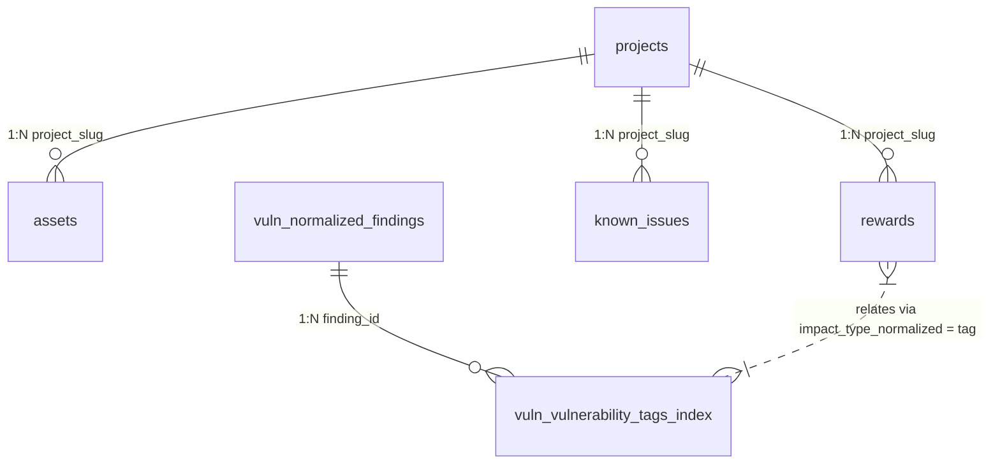

# Dynamic Cross-Database Analytics & Mathematical Profitability Scoring Engine Architecture

## Overview

The Dynamic Cross-Database Analytics Engine relationally bridges our live bug bounty platform storage ledger (`unified_bug_bounties.db`) with our global security research dataset (`vulnerabilities.db`). By dynamically attaching historical findings and vulnerability tags, the math engine computes quantitative target yield rankings ($E(P)$) to prioritize research efficiency across bounty programs.

---

## 1. Mathematical Scoring Formulas

### A. Algorithmic Success Probability ($P_{\text{success}}$)

The success probability combines ecosystem vulnerability tag density with project audit history:

$$P_{\text{success}} = \left( \frac{\text{Global Findings for Target Impact Tag}}{\text{Total Global Findings Pool Across Ecosystem}} \right) \times \left( \frac{1}{1 + \ln(1 + \text{Historical Protocol Audits Count})} \right)$$

- **Global Tag Density Ratio**: Sourced via scalar query `SELECT COUNT(*) FROM vuln.vulnerability_tags_index WHERE tag = target_tag` normalized by `SELECT COUNT(*) FROM vuln.normalized_findings`.
- **Audits Count**: Derived dynamically as `2 + (Count of entries in project's local known_issues table)`.
- **Fallback Protection**: If global findings or tag matches resolve to 0, $P_{\text{success}}$ defaults to a baseline fallback of `0.0001` to prevent division by zero or absolute zero dropouts.

### B. Algorithmic Complexity Time Index ($T$)

The complexity index measures relative auditing effort based on target scope properties:

$$T = \text{Files Count} \times \text{Nesting Depth Modifier} \times (1.5 \text{ if KYC required else } 1.0)$$

- **Files Count**: Number of child scope entries in the `assets` table for the target slug (defaults to 5 if no asset records exist).
- **Nesting Depth Modifier**: $1.0 + (0.05 \times \min(10, \text{Files Count}))$.
- **KYC Multiplier**: $1.5$ multiplier applied if `kyc_required` is `1` (true), otherwise $1.0$.

### C. Realized Payout Economic Clamping Invariant

Bounty payout limits are clamped using total value locked (TVL) metrics and reward scaling parameters:

$$\text{Calculated Real Reward} = \min\left(\text{Stated Max Reward}, \alpha \times \text{TVL}\right)$$

- **Scaling Ratio ($\alpha$)**: Extracted from `scaling_percentage / 100.0`. Defaults to $1.0$ if null or 0.
- **TVL Baseline**: Baseline constant set to $\$15,000,000.0$.

### D. Expected Profitability Yield ($E(P)$)

The net profitability yield calculates expected monetary return minus opportunity time cost:

$$E(P) = P_{\text{success}} \times \text{Calculated Real Reward} - (C_{\text{time}} \times T)$$

- **Resource Consumption Rate ($C_{\text{time}}$)**: Fixed constant at $\$150.0/\text{hr}$.

---

## 2. Cross-Database Relational Schema Layout

### Schemas

#### Unified Bug Bounty Ledger (`unified_bug_bounties.db`)
- `projects`: Master project metadata (slug, name, source platform, bounty caps, KYC requirements, scaling percentage).
- `assets`: Target boundaries and child asset files associated per project.
- `rewards`: Severity levels, max payout USD, and `impact_type_normalized`.
- `known_issues`: Known issues and historical audit entries per project.

#### Historical Vulnerabilities Ledger (`vulnerabilities.db` attached as `vuln`)
- `vuln.normalized_findings`: Ecosystem findings database across all vulnerability research pools.
- `vuln.vulnerability_tags_index`: Mapping between finding IDs and standardized taxonomy tags (`tag`).

---

## 3. Operational Run-Book & Research Targeting Workflow

1. **Database Mounting**: Upon initiating the matrix engine, `attach_vulnerabilities_db(conn)` mounts `vulnerabilities.db` as `vuln` attached schema safely.
2. **Matrix Generation**: Executing `get_target_profitability_matrix(conn)` queries cross-database counts, evaluates $P_{\text{success}}$, $T$, economic reward caps, and calculates $E(P)$.
3. **API Serialization**: The API route `/api/analytics/profitability-matrix` sanitizes floating-point calculations against `NaN`/`Inf` dropouts and truncates precision to 4 decimal places via `round(val, 4)`.
4. **Target Prioritization**:
   - High positive $E(P)$ scores identify protocols with high bug tag density, low structural code nesting, and high payout caps relative to TVL.
   - Low or negative $E(P)$ scores filter out targets with high audit density, small asset rewards, or mandatory KYC overhead.
