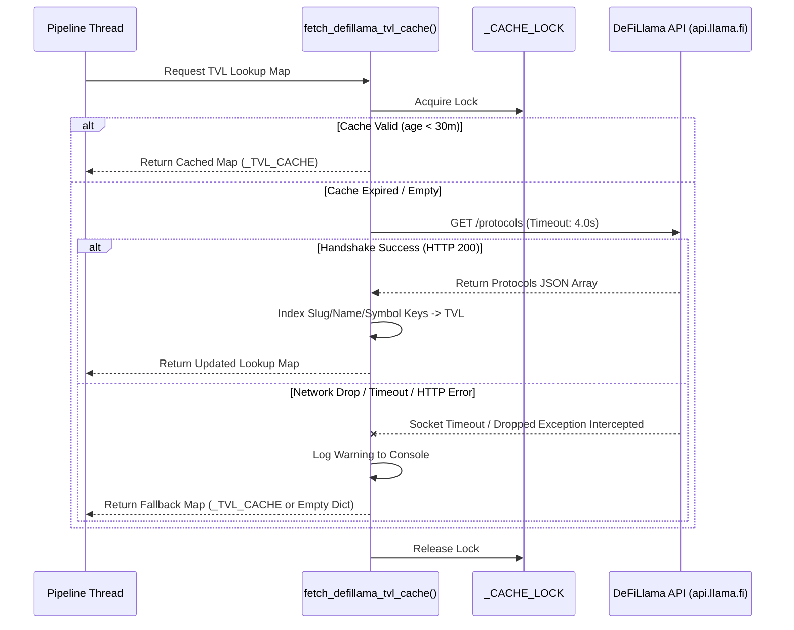
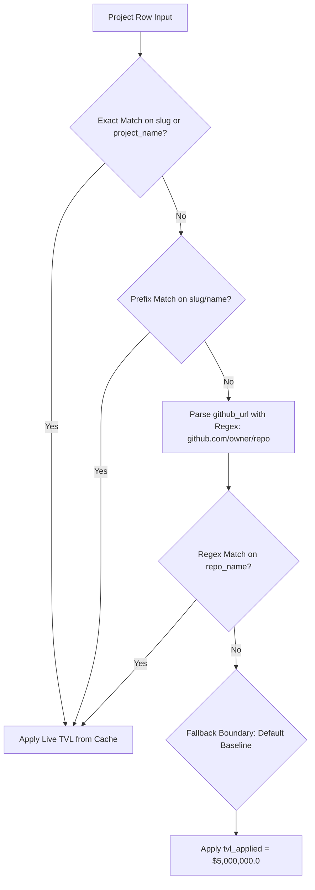

# Technical Architecture Specification: Live TVL Ingestion & Thread-Safe Cache Subsystem

## Overview

This architecture document specifies the live REST ingestion client, thread-safe memory cache layer, and relational string-matching algorithm that replaces static TVL baseline placeholders ($15M USD) with live Total Value Locked (TVL) metrics from DeFiLlama's public API.

---

## 1. Network Client & Resilience Architecture

### Components & Invariants
- **Endpoint Target**: `https://api.llama.fi/protocols`
- **Request Engine**: `urllib.request` standard library module.
- **Timeout Invariant**: Strict 4.0-second socket timeout limit enforced on every outbound HTTP connection.
- **Concurrency Protection**: Module-level `threading.Lock()` (`_CACHE_LOCK`) wraps request execution to prevent thread race conditions or duplicate HTTP calls across worker threads.
- **TTL Cache Horizon**: 1800 seconds (30 minutes) cache retention (`_CACHE_TTL_SECONDS`).

### Network & Dropout Sequence



---

## 2. Multi-Tiered Relational String Matching & Clamping Algorithm

Target projects from our `projects` database table are matched against the normalized `_TVL_CACHE` using a 4-step lookup strategy:



### Text Bound Regex Pattern
```python
match = re.search(r"github\.com/([^/]+)/([^/]+)", str(github_url or ""))
repo_name = match.group(2).strip().lower().rstrip("/") if match else None
```

---

## 3. Mathematical Rationale & Economic Reward Scaling

Static TVL baselines distort bug bounty target prioritization by treating small, unbacked contracts identically to billion-dollar protocols. Scaling effective maximum payout limits directly against live TVL prevents prioritizing targets with inflated, unrealizable reward ceilings.

### Mathematical Profitability Formulas

$$\text{Effective Max Payout} = \min\left(\text{Stated Max Reward}, \alpha \times \text{TVL}_{\text{applied}}\right)$$

$$P_{\text{success}} = \left( \frac{\text{Global Tag Findings}}{\text{Total Global Pool}} \right) \times \left( \frac{1}{1 + \ln(1 + \text{Historical Audits})} \right)$$

$$E(P) = P_{\text{success}} \times \text{Effective Max Payout} - (C_{\text{time}} \times T)$$

- **$\alpha$ (Scaling Percentage)**: Scaling factor extracted from `scaling_percentage / 100.0` (defaults to $1.0$).
- **$C_{\text{time}}$**: Opportunity cost constant fixed at $\$150.0/\text{hr}$.
- **$T$**: Algorithmic complexity time index.
